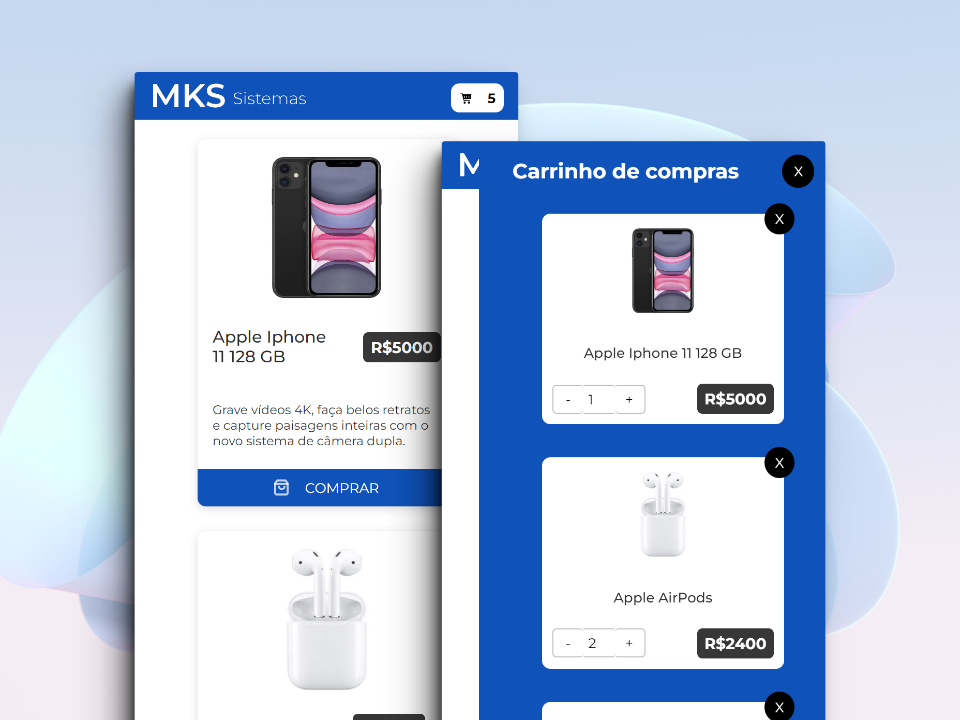
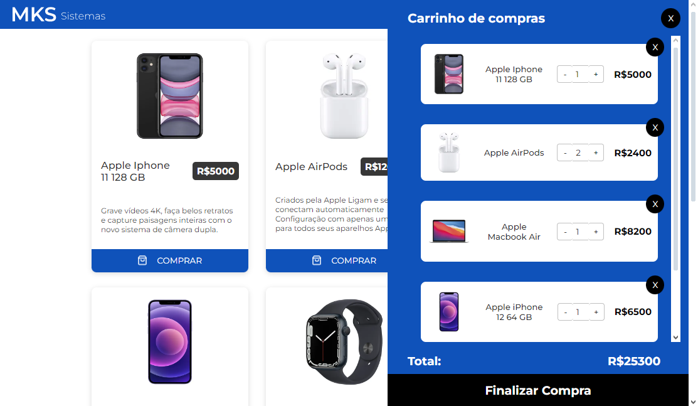
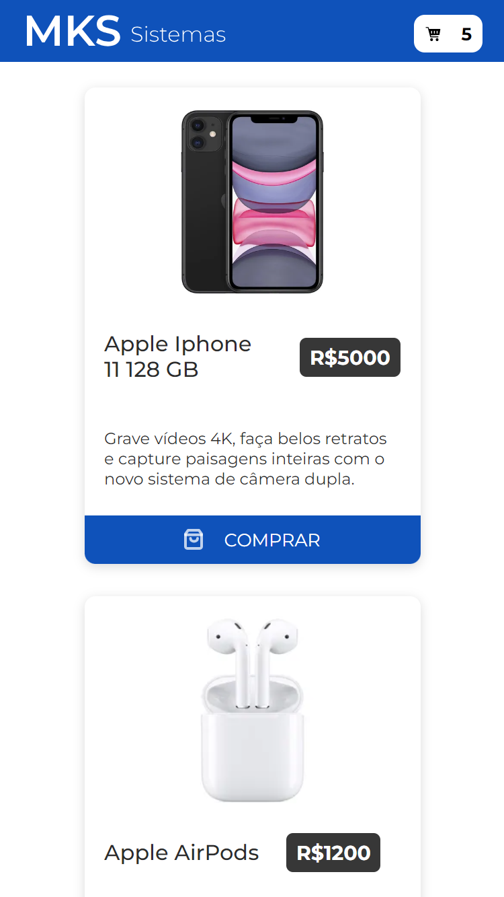
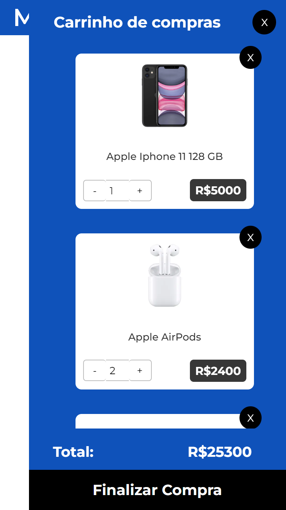

<p align="center"></p>

# <p align="center">MKS Store</p>

<a href="https://aliine98.github.io/react-mks-frontend-challenge"><p align="center">Deploy: https://aliine98.github.io/react-mks-frontend-challenge</p></a>

<p align="center">
  <a href="https://www.codefactor.io/repository/github/aliine98/react-mks-frontend-challenge"></a>
  <a href="https://snyk.io/test/github/aliine98/react-mks-frontend-challenge"></a>
  
  
  <a href="https://www.linkedin.com/in/aline-bevilacqua/"></a>
</p>


> Table of Contents
> <ol>
>   <li><a href="#-sobre-o-projeto">Sobre</a></li>
>   <li><a href="#-funcionalidades">Funcionalidades</a></li>
>   <li><a href="#-screenshots">Screenshots</a></li>
>   <li><a href="#-tecnologias">Tecnologias</a></li>
>   <li><a href="#-rodando-localmente">Rodando localmente</a></li>
>   <li><a href="#-como-contribuir-para-o-projeto">Como contribuir para o projeto</a></li>
>   <li><a href="#-licença">Licença</a>
> </ol>

## 💻 Sobre o projeto

Uma página de produtos e carrinho de compras. Consome a API disponível neste <a href="https://mks-frontend-challenge-04811e8151e6.herokuapp.com/api-docs/#/Product/get_products">site</a>, que fornece as informações dos produtos.

## ✨ Funcionalidades

- Adiciona produto no carrinho de compras
- Botão input para aumentar ou diminuir a quantidade de cada item no carrinho
- Cálculo do preço total

## 🎨 Screenshots

Layout de acordo com o protótipo do <a href="https://www.figma.com/file/Z4z8osDbK1ET7cjNzFRMrK/MKS-Front-end-challenge?node-id=2%3A296&mode=dev">Figma</a>

<details>
  <summary>Desktop:</summary>
  <p align="center"></p>
</details>
<details>
  <summary>Mobile:</summary>
  <p align="center">
   
   
  <p>
</details>

## 🛠 Tecnologias

- [](https://www.typescriptlang.org/)
- [](https://react.dev/)
- [](https://styled-components.com/)
- [](https://tanstack.com/query/latest/)

## 🚀 Rodando localmente

Clone o projeto

```bash
  git clone https://github.com/aliine98/react-mks-frontend-challenge
```

Entre no diretório do projeto

```bash
  cd react-mks-frontend-challenge
```

Instale as dependências

```bash
  npm install
```

Abra o servidor

```bash
  npm run dev
```

## 😯 Como contribuir para o projeto

1. Faça um **fork** do projeto.
2. Crie uma nova branch com as suas alterações: `git checkout -b my-feature`
3. Salve as alterações e crie uma mensagem de commit contando o que você fez: `git commit -m ":sparkles: feat: My new feature"`
4. Envie as suas alterações: `git push origin my-feature`
5. No seu repositório clique num botão chamado _**Compare & Pull Request**_ e crie o seu PR.

> Caso tenha alguma dúvida confira este [guia de como contribuir no GitHub](https://github.com/firstcontributions/first-contributions)

## 📝 Licença


Feito com ❤️ por <a href="https://github.com/aliine98">Aline Bevilacqua</a>!

<a href="#mks-store">⬆ Voltar ao topo</a>
